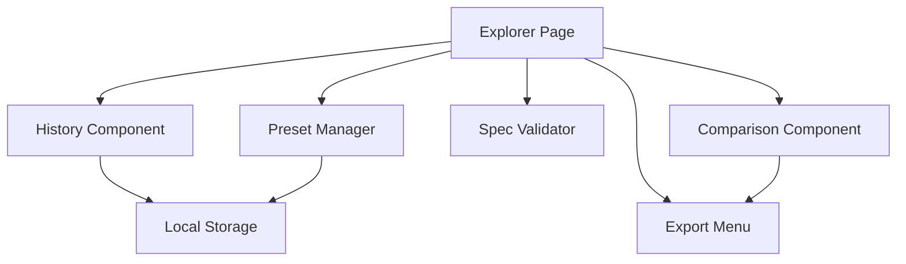

# Advanced Features Design

## Overview

The advanced features enhance the application with professional-grade capabilities for API development and testing. This includes authentication helpers in generated SDKs, comprehensive request/response history tracking, side-by-side response comparison, multiple export formats, spec quality validation, and request preset management. The design focuses on power user workflows while maintaining ease of use.

## Architecture

### Component Diagram



## Components and Interfaces

### 1. Authentication Helper Generator (`packages/openapi/src/auth-helper-generator.ts`)

Generates authentication code and documentation for SDKs.

```typescript
interface AuthConfig {
  type: "apiKey" | "bearer" | "oauth" | "basic";
  location?: "header" | "query" | "cookie";
  name?: string;
}

class AuthHelperGenerator {
  generateAuthSection(spec: OpenAPISpec): string;

  private generateApiKeyExample(config: AuthConfig): string;
  private generateBearerExample(): string;
  private generateOAuthExample(): string;
  private generateBasicAuthExample(): string;
}
```

**Generated README Section Example**:

```markdown
## Authentication

This API uses API Key authentication. Configure your client as follows:

\`\`\`typescript
import { Configuration, DefaultApi } from 'my-api-client';

const config = new Configuration({
basePath: 'https://api.example.com',
apiKey: 'your-api-key-here'
});

const api = new DefaultApi(config);
\`\`\`

### Environment Variables

For production use, store your API key in environment variables:

\`\`\`typescript
const config = new Configuration({
basePath: process.env.API_BASE_URL,
apiKey: process.env.API_KEY
});
\`\`\`
```

### 2. Enhanced Endpoint Documentation (`apps/web/components/EndpointDocumentation.tsx`)

Displays comprehensive endpoint information.

```typescript
interface EndpointDocumentationProps {
  endpoint: EndpointInfo;
  spec: OpenAPISpec;
}

export function EndpointDocumentation({
  endpoint,
  spec,
}: EndpointDocumentationProps) {
  // Display description
  // Display notes and additional docs
  // Display response examples
  // Display deprecation warnings
  // Display external links
}
```

**UI Layout**:

```
┌─────────────────────────────────────────┐
│ GET /pets/{petId}                       │
│ ⚠️  DEPRECATED - Use /v2/pets instead   │
├─────────────────────────────────────────┤
│ Description:                            │
│ Returns a single pet by ID              │
│                                         │
│ Notes:                                  │
│ - Requires authentication               │
│ - Rate limited to 100 requests/min      │
│                                         │
│ Response Examples:                      │
│ ┌─ 200 OK ─────────────────────────┐   │
│ │ {                                 │   │
│ │   "id": 123,                      │   │
│ │   "name": "Fluffy",               │   │
│ │   "status": "available"           │   │
│ │ }                                 │   │
│ └───────────────────────────────────┘   │
│                                         │
│ 📚 External Docs:                       │
│ https://docs.example.com/pets           │
└─────────────────────────────────────────┘
```

### 3. Request History (`apps/web/components/RequestHistory.tsx`)

Tracks and displays API request history.

```typescript
interface HistoryEntry {
  id: string;
  timestamp: Date;
  method: string;
  endpoint: string;
  url: string;
  headers: Record<string, string>;
  body?: any;
  response: {
    status: number;
    statusText: string;
    headers: Record<string, string>;
    body: any;
    time: number; // Response time in ms
  };
}

interface RequestHistoryProps {
  onReplay?: (entry: HistoryEntry) => void;
}

export function RequestHistory({ onReplay }: RequestHistoryProps) {
  const [history, setHistory] = useState<HistoryEntry[]>([]);
  const [selectedEntry, setSelectedEntry] = useState<HistoryEntry | null>(null);

  // Load history from storage
  // Display history list
  // Show entry details on click
  // Provide replay functionality
}
```

**History Storage**:

```typescript
// Store in sessionStorage (cleared on tab close)
interface HistoryStorage {
  entries: HistoryEntry[];
  maxEntries: 50;
}

const addToHistory = (entry: HistoryEntry) => {
  const history = getHistory();
  history.entries.unshift(entry);
  if (history.entries.length > history.maxEntries) {
    history.entries = history.entries.slice(0, history.maxEntries);
  }
  sessionStorage.setItem("request-history", JSON.stringify(history));
};
```

**UI Design**:

```
┌─────────────────────────────────────────┐
│ Request History (23)          [Clear]   │
├─────────────────────────────────────────┤
│ 🟢 200 GET /pets/123        2:34 PM     │
│    Response time: 145ms                 │
│    [Replay] [Export]                    │
├─────────────────────────────────────────┤
│ 🟠 404 GET /pets/999        2:33 PM     │
│    Response time: 89ms                  │
│    [Replay] [Export]                    │
├─────────────────────────────────────────┤
│ 🟢 201 POST /pets           2:30 PM     │
│    Response time: 234ms                 │
│    [Replay] [Export]                    │
└─────────────────────────────────────────┘
```

### 4. Response Comparison (`apps/web/components/ResponseComparison.tsx`)

Compares mock and real API responses.

```typescript
interface ResponseComparisonProps {
  endpoint: EndpointInfo;
  requestConfig: RequestConfig;
  mockServerUrl: string;
  realApiUrl: string;
}

interface ComparisonResult {
  mockResponse: any;
  realResponse: any;
  differences: Difference[];
  matches: string[];
  mockOnly: string[];
  realOnly: string[];
}

export function ResponseComparison({
  endpoint,
  requestConfig,
  mockServerUrl,
  realApiUrl,
}: ResponseComparisonProps) {
  const [comparison, setComparison] = useState<ComparisonResult | null>(null);
  const [loading, setLoading] = useState(false);

  const executeComparison = async () => {
    // Execute request against mock server
    // Execute request against real API
    // Compare responses
    // Highlight differences
  };

  // Display side-by-side comparison
  // Highlight differences
  // Provide export option
}
```

**Comparison Algorithm**:

```typescript
const compareResponses = (mock: any, real: any): ComparisonResult => {
  const differences: Difference[] = [];
  const matches: string[] = [];
  const mockOnly: string[] = [];
  const realOnly: string[] = [];

  // Deep comparison of JSON structures
  // Identify matching fields
  // Identify fields only in mock
  // Identify fields only in real
  // Identify fields with different values

  return {
    mockResponse: mock,
    realResponse: real,
    differences,
    matches,
    mockOnly,
    realOnly,
  };
};
```

**UI Design**:

```
┌──────────────────────────────────────────────────────────┐
│ Response Comparison                    [Export Report]   │
├────────────────────────┬─────────────────────────────────┤
│ Mock Server            │ Real API                        │
├────────────────────────┼─────────────────────────────────┤
│ {                      │ {                               │
│   "id": 123,          ✓│   "id": 123,                   │
│   "name": "Fluffy",   ✓│   "name": "Fluffy",            │
│   "status": "available"│   "status": "sold"             │
│                       ⚠│                                │
│   "price": 29.99      ⚠│   // missing                   │
│                        │   "owner": "John"              │
│                       ⚠│                                │
│ }                      │ }                               │
└────────────────────────┴─────────────────────────────────┘

Legend:
✓ = Matching (green)
⚠ = Different or missing (yellow/red)
```

### 5. Export Menu (`apps/web/components/ExportMenu.tsx`)

Provides multiple export options.

```typescript
interface ExportMenuProps {
  request?: RequestConfig;
  response?: any;
  history?: HistoryEntry[];
  spec?: OpenAPISpec;
}

export function ExportMenu({
  request,
  response,
  history,
  spec,
}: ExportMenuProps) {
  const exportAsCurl = () => {
    // Generate cURL command
    // Copy to clipboard or download
  };

  const exportAsPostman = () => {
    // Generate Postman collection
    // Download as JSON
  };

  const exportHistory = () => {
    // Export history as JSON
    // Download file
  };

  const exportSpec = (format: "json" | "yaml") => {
    // Export OpenAPI spec
    // Download file
  };
}
```

**cURL Generation**:

```typescript
const generateCurl = (request: RequestConfig): string => {
  let curl = `curl -X ${request.method} '${request.url}'`;

  // Add headers
  Object.entries(request.headers || {}).forEach(([key, value]) => {
    curl += ` \\\n  -H '${key}: ${value}'`;
  });

  // Add body
  if (request.body) {
    curl += ` \\\n  -d '${JSON.stringify(request.body)}'`;
  }

  return curl;
};
```

**Postman Collection Generation**:

```typescript
const generatePostmanCollection = (
  endpoint: EndpointInfo,
  request: RequestConfig
) => {
  return {
    info: {
      name: `${endpoint.method} ${endpoint.path}`,
      schema:
        "https://schema.getpostman.com/json/collection/v2.1.0/collection.json",
    },
    item: [
      {
        name: endpoint.summary || endpoint.path,
        request: {
          method: request.method,
          header: Object.entries(request.headers || {}).map(([key, value]) => ({
            key,
            value,
            type: "text",
          })),
          url: {
            raw: request.url,
            protocol: "https",
            host: [
              /* parsed from URL */
            ],
            path: [
              /* parsed from URL */
            ],
          },
          body: request.body
            ? {
                mode: "raw",
                raw: JSON.stringify(request.body, null, 2),
                options: {
                  raw: {
                    language: "json",
                  },
                },
              }
            : undefined,
        },
      },
    ],
  };
};
```

### 6. Spec Validator (`apps/web/lib/spec-validator.ts`)

Validates OpenAPI spec quality.

```typescript
interface ValidationIssue {
  severity: "error" | "warning" | "info";
  category: "description" | "examples" | "deprecated" | "security";
  message: string;
  path: string;
  suggestion?: string;
}

interface ValidationReport {
  score: number; // 0-100
  issues: ValidationIssue[];
  summary: {
    totalEndpoints: number;
    missingDescriptions: number;
    missingExamples: number;
    deprecatedEndpoints: number;
  };
}

class SpecValidator {
  validate(spec: OpenAPISpec): ValidationReport;

  private checkDescriptions(spec: OpenAPISpec): ValidationIssue[];
  private checkExamples(spec: OpenAPISpec): ValidationIssue[];
  private checkDeprecated(spec: OpenAPISpec): ValidationIssue[];
  private checkSecurity(spec: OpenAPISpec): ValidationIssue[];
  private calculateScore(issues: ValidationIssue[]): number;
}
```

**Validation Rules**:

1. **Missing Descriptions**: Endpoints without description or summary
2. **Missing Examples**: Response schemas without examples
3. **Deprecated Endpoints**: Endpoints marked as deprecated
4. **Security Issues**: Endpoints without security requirements
5. **Incomplete Schemas**: Schemas missing required properties

**UI Display**:

```
┌─────────────────────────────────────────┐
│ Spec Quality Report          Score: 78  │
├─────────────────────────────────────────┤
│ ⚠️  12 endpoints missing descriptions    │
│ ⚠️  8 responses missing examples         │
│ ℹ️  3 deprecated endpoints found         │
│ ✓  All endpoints have security          │
├─────────────────────────────────────────┤
│ Suggestions:                            │
│ • Add descriptions to improve docs      │
│ • Add response examples for testing     │
│ • Consider removing deprecated endpoints│
│                                         │
│ 📚 Best Practices Guide                 │
└─────────────────────────────────────────┘
```

### 7. Preset Manager (`apps/web/components/PresetManager.tsx`)

Manages saved request presets.

```typescript
interface RequestPreset {
  id: string;
  name: string;
  endpointId: string;
  parameters: Record<string, any>;
  headers: Record<string, string>;
  body?: any;
  createdAt: Date;
}

interface PresetManagerProps {
  endpointId: string;
  currentConfig: RequestConfig;
  onLoadPreset: (preset: RequestPreset) => void;
}

export function PresetManager({
  endpointId,
  currentConfig,
  onLoadPreset,
}: PresetManagerProps) {
  const [presets, setPresets] = useState<RequestPreset[]>([]);
  const [showSaveDialog, setShowSaveDialog] = useState(false);

  const savePreset = (name: string) => {
    // Create preset from current config
    // Save to localStorage
    // Update presets list
  };

  const loadPreset = (presetId: string) => {
    // Load preset from storage
    // Call onLoadPreset callback
  };

  const deletePreset = (presetId: string) => {
    // Remove from storage
    // Update presets list
  };
}
```

**Storage Structure**:

```typescript
// localStorage key: 'request-presets'
interface PresetStorage {
  presets: Record<string, RequestPreset[]>; // Keyed by endpointId
}
```

**UI Design**:

```
┌─────────────────────────────────────────┐
│ Request Presets          [Save Current] │
├─────────────────────────────────────────┤
│ 📋 Production Test                      │
│    Created: 2 days ago      [Load] [×]  │
├─────────────────────────────────────────┤
│ 📋 Error Case                           │
│    Created: 1 week ago      [Load] [×]  │
├─────────────────────────────────────────┤
│ 📋 Happy Path                           │
│    Created: 2 weeks ago     [Load] [×]  │
└─────────────────────────────────────────┘
```

## Data Models

### History Entry Schema

```typescript
interface HistoryEntrySchema {
  id: string;
  timestamp: string; // ISO 8601
  request: {
    method: string;
    url: string;
    headers: Record<string, string>;
    body?: any;
  };
  response: {
    status: number;
    statusText: string;
    headers: Record<string, string>;
    body: any;
    time: number;
  };
}
```

### Comparison Report Schema

```typescript
interface ComparisonReportSchema {
  timestamp: string;
  endpoint: string;
  mockResponse: any;
  realResponse: any;
  analysis: {
    matchingFields: string[];
    differentFields: Array<{
      path: string;
      mockValue: any;
      realValue: any;
    }>;
    mockOnlyFields: string[];
    realOnlyFields: string[];
  };
}
```

## Testing Strategy

### Unit Tests

1. **AuthHelperGenerator Tests**

   - Test API key example generation
   - Test Bearer token example generation
   - Test OAuth example generation

2. **SpecValidator Tests**

   - Test description checking
   - Test example checking
   - Test score calculation

3. **Export Functions Tests**
   - Test cURL generation
   - Test Postman collection generation
   - Test history export

### Component Tests

1. **RequestHistory Tests**

   - Test history display
   - Test entry selection
   - Test replay functionality

2. **ResponseComparison Tests**

   - Test comparison execution
   - Test difference highlighting
   - Test export functionality

3. **PresetManager Tests**
   - Test preset saving
   - Test preset loading
   - Test preset deletion

### Integration Tests

1. **History Workflow**

   - Execute request → Verify added to history → Replay → Verify same result

2. **Comparison Workflow**

   - Start mock server → Execute comparison → Verify differences shown

3. **Export Workflow**
   - Execute request → Export as cURL → Verify command works

## Performance Considerations

1. **History Storage**

   - Limit to 50 entries
   - Use efficient serialization
   - Clean up on session end

2. **Comparison**

   - Limit response size for comparison (max 1MB)
   - Use web workers for large comparisons
   - Cache comparison results

3. **Validation**
   - Run validation asynchronously
   - Cache validation results
   - Debounce re-validation

## Future Enhancements

1. **Advanced History**

   - Search and filter history
   - Export history to CSV
   - History analytics

2. **Collaboration**

   - Share presets with team
   - Share comparison reports
   - Collaborative testing

3. **Testing Automation**
   - Generate test suites from history
   - Automated regression testing
   - Performance benchmarking
