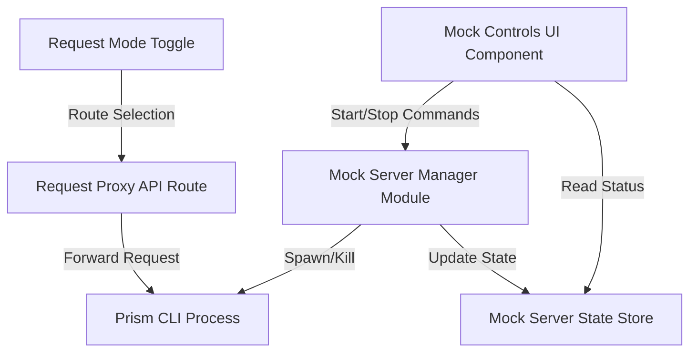

# Mock Server Integration Design

## Overview

The mock server integration feature provides automated mock API server generation using Stoplight Prism. The system consists of three main layers: a backend server manager that controls Prism processes, API routes for server lifecycle management, and frontend UI components for user interaction. The design enables seamless toggling between real and mock endpoints, automatic server startup, and robust error handling.

## Architecture

### Component Diagram



### Data Flow

1. **Server Startup Flow**:

   - User uploads spec → System writes spec to temp file → Manager spawns Prism process → Prism starts on available port → Manager stores server info → UI displays server URL

2. **Request Routing Flow**:

   - User toggles mock mode → Request builder updates target URL → User executes request → Proxy routes to mock/real endpoint → Response returns to viewer

3. **Server Shutdown Flow**:
   - User clicks stop → Manager sends kill signal to Prism process → Process terminates → Manager updates state → UI reflects stopped status

## Components and Interfaces

### 1. Mock Server Manager (`packages/openapi/src/mock-manager.ts`)

Core module for managing Prism server lifecycle.

```typescript
interface MockServerConfig {
  specPath: string;
  port?: number;
  host?: string;
}

interface MockServerInfo {
  url: string;
  port: number;
  pid: number;
  status: "running" | "stopped" | "starting" | "error";
  startedAt: Date;
}

class MockServerManager {
  private servers: Map<string, MockServerInfo>;

  async startServer(config: MockServerConfig): Promise<MockServerInfo>;
  async stopServer(specId: string): Promise<void>;
  getServerInfo(specId: string): MockServerInfo | null;
  async findAvailablePort(startPort: number): Promise<number>;
  private spawnPrismProcess(specPath: string, port: number): ChildProcess;
  private monitorProcess(process: ChildProcess, specId: string): void;
}
```

**Key Responsibilities**:

- Spawn and manage Prism CLI processes using Node.js `child_process`
- Track server state in memory (port, PID, status)
- Find available ports automatically
- Monitor process health and handle crashes
- Clean up processes on shutdown

### 2. Mock Server API Routes

#### `/api/mock/start` (POST)

```typescript
// Request
{
  specId: string;
  spec: OpenAPISpec;
  port?: number;
}

// Response
{
  success: boolean;
  serverInfo?: MockServerInfo;
  error?: string;
}
```

**Implementation**:

- Write spec to temp file in `/tmp/splice-specs/{specId}.json`
- Call `MockServerManager.startServer()`
- Return server URL and port
- Handle errors (port occupied, Prism not installed, invalid spec)

#### `/api/mock/stop` (POST)

```typescript
// Request
{
  specId: string;
}

// Response
{
  success: boolean;
  error?: string;
}
```

**Implementation**:

- Call `MockServerManager.stopServer()`
- Clean up temp spec file
- Return success status

#### `/api/mock/status` (GET)

```typescript
// Query params: ?specId=xxx

// Response
{
  serverInfo: MockServerInfo | null;
}
```

**Implementation**:

- Query `MockServerManager.getServerInfo()`
- Return current server status

### 3. Mock Controls Component (`apps/web/components/MockServerControls.tsx`)

UI component for server management.

```typescript
interface MockServerControlsProps {
  specId: string;
  spec: OpenAPISpec;
  onServerStart?: (info: MockServerInfo) => void;
  onServerStop?: () => void;
}

export function MockServerControls(props: MockServerControlsProps) {
  // State: serverInfo, loading, error
  // Handlers: handleStart, handleStop, refreshStatus
  // UI: Status badge, server URL, start/stop buttons
}
```

**UI Elements**:

- Status badge (green for running, gray for stopped, yellow for starting)
- Server URL as clickable link (opens in new tab)
- Port number display
- Start button (disabled when running)
- Stop button (disabled when stopped)
- Error message display
- Loading spinner during operations

### 4. Request Mode Context (`apps/web/contexts/mock-server-context.tsx`)

Global state for mock server mode.

```typescript
interface MockServerContextValue {
  isMockMode: boolean;
  setMockMode: (enabled: boolean) => void;
  mockServerInfo: MockServerInfo | null;
  setMockServerInfo: (info: MockServerInfo | null) => void;
}

export const MockServerProvider: React.FC<{ children: React.ReactNode }>;
export const useMockServer: () => MockServerContextValue;
```

**Purpose**:

- Share mock mode state across components
- Store current mock server info
- Provide toggle functionality

### 5. Request Proxy Enhancement (`apps/web/app/api/proxy/route.ts`)

Update existing proxy to support mock routing.

```typescript
// Request
{
  url: string;
  method: string;
  headers?: Record<string, string>;
  body?: any;
  useMock?: boolean;
  mockServerUrl?: string;
}

// Logic
if (useMock && mockServerUrl) {
  // Replace base URL with mock server URL
  targetUrl = url.replace(originalBaseUrl, mockServerUrl);
} else {
  targetUrl = url;
}
```

### 6. Request Builder Integration

Update `RequestBuilder` component to include mock toggle.

```typescript
// Add toggle control
<Switch
  checked={isMockMode}
  onChange={setMockMode}
  disabled={!mockServerInfo}
>
  Use Mock Server
</Switch>

// Update request preview
<RequestPreview
  url={isMockMode ? mockUrl : realUrl}
  method={method}
  headers={headers}
  body={body}
/>
```

## Data Models

### Mock Server State

```typescript
interface MockServerState {
  servers: Record<string, MockServerInfo>;
  autoStart: boolean;
}

// Stored in memory (singleton)
// Could be persisted to localStorage for auto-start preference
```

### Temp File Structure

```
/tmp/splice-specs/
  ├── {specId-1}.json
  ├── {specId-2}.json
  └── ...
```

Files are cleaned up when:

- Server is stopped
- Application restarts
- After 1 hour of inactivity

## Error Handling

### Error Scenarios

1. **Prism Not Installed**

   - Detection: Check if `prism` command exists
   - Response: Display installation instructions
   - Recovery: Provide link to Prism docs

2. **Port Already in Use**

   - Detection: Prism process fails with EADDRINUSE
   - Response: Automatically try next port (4011, 4012, etc.)
   - Recovery: Retry with new port up to 10 times

3. **Invalid Spec**

   - Detection: Prism exits with validation error
   - Response: Display spec validation errors
   - Recovery: User must fix spec and retry

4. **Process Crash**

   - Detection: Monitor process exit events
   - Response: Update status to "stopped", log error
   - Recovery: User can restart manually

5. **Network Timeout**
   - Detection: Mock server doesn't respond within 30s
   - Response: Display timeout error
   - Recovery: Suggest checking Prism logs

### Error Messages

```typescript
const ERROR_MESSAGES = {
  PRISM_NOT_FOUND:
    "Prism CLI not found. Install with: npm install -g @stoplight/prism-cli",
  PORT_IN_USE: "Could not find available port. Please stop other services.",
  INVALID_SPEC: "OpenAPI specification is invalid. Check the errors below.",
  PROCESS_CRASHED: "Mock server crashed unexpectedly. Check logs for details.",
  TIMEOUT: "Mock server did not respond in time. Try restarting.",
};
```

## Testing Strategy

### Unit Tests

1. **MockServerManager Tests**

   - Test port allocation logic
   - Test process spawning (mocked)
   - Test state management
   - Test error handling

2. **API Route Tests**

   - Test /api/mock/start with valid spec
   - Test /api/mock/start with invalid spec
   - Test /api/mock/stop
   - Test /api/mock/status

3. **Component Tests**
   - Test MockServerControls rendering
   - Test start/stop button interactions
   - Test status display updates
   - Test error message display

### Integration Tests

1. **End-to-End Server Lifecycle**

   - Upload spec → Auto-start server → Verify running → Stop server → Verify stopped

2. **Request Routing**

   - Start mock server → Toggle mock mode → Execute request → Verify mock response → Toggle real mode → Execute request → Verify real response

3. **Error Recovery**
   - Start server with invalid spec → Verify error → Fix spec → Retry → Verify success

### Manual Testing Checklist

- [ ] Upload Petstore spec, verify auto-start
- [ ] Click stop, verify server stops
- [ ] Click start, verify server restarts
- [ ] Toggle mock mode, execute request, verify mock response
- [ ] Toggle real mode, execute request, verify real response
- [ ] Upload invalid spec, verify error handling
- [ ] Start server, kill Prism process manually, verify crash detection
- [ ] Test with multiple specs simultaneously

## Performance Considerations

1. **Server Startup Time**

   - Target: < 3 seconds for typical specs
   - Optimization: Use Prism's dynamic mode for faster startup

2. **Memory Usage**

   - Limit: One mock server per spec (max 5 concurrent)
   - Cleanup: Stop servers after 1 hour of inactivity

3. **Port Management**
   - Range: 4010-4099 (90 available ports)
   - Reuse: Release ports immediately on stop

## Security Considerations

1. **Temp File Security**

   - Store in OS temp directory with restricted permissions
   - Clean up files on server stop
   - Validate spec content before writing

2. **Process Isolation**

   - Run Prism processes with limited privileges
   - Prevent command injection in spec paths
   - Sanitize all user inputs

3. **Network Security**
   - Bind mock servers to localhost only
   - No external access to mock servers
   - CORS headers configured appropriately

## Future Enhancements

1. **Advanced Prism Configuration**

   - Custom response delays
   - Error rate simulation
   - Dynamic response modification

2. **Multi-Spec Support**

   - Run multiple mock servers simultaneously
   - Switch between specs in UI

3. **Persistent Mock State**

   - Save mock server preferences
   - Auto-restart on app reload

4. **Mock Response Customization**
   - Override specific endpoint responses
   - Add custom examples
   - Simulate error scenarios
