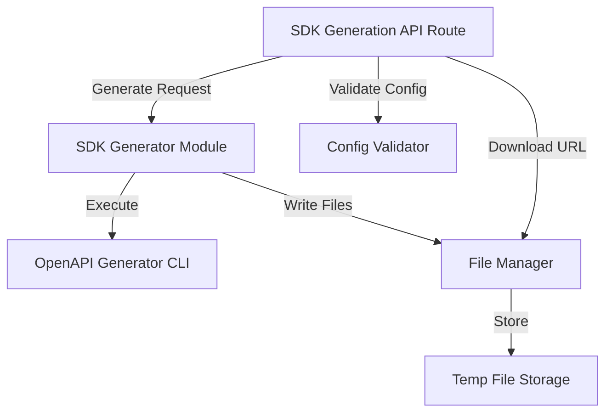

# SDK Generator Core Design

## Overview

The SDK generator core provides automated TypeScript SDK generation from OpenAPI specifications using OpenAPI Generator CLI. The system consists of a backend generator module that orchestrates the generation process, API routes for handling generation requests, and a file management system for temporary storage and delivery of generated SDKs. The design emphasizes reliability, performance, and user-friendly error handling.

## Architecture

### Component Diagram



### Data Flow

1. **Generation Request Flow**:

   - User submits spec + config → API validates config → Generator writes spec to temp file → OpenAPI Generator CLI executes → Generated files written to temp directory → ZIP archive created → Download URL returned

2. **Download Flow**:

   - User requests download URL → File Manager locates ZIP file → Stream ZIP to response → Track download completion

3. **Cleanup Flow**:
   - Background job runs every 15 minutes → Identifies files older than 1 hour → Deletes expired files and directories

## Components and Interfaces

### 1. SDK Generator Module (`packages/openapi/src/sdk-generator.ts`)

Core module for SDK generation orchestration.

```typescript
interface SDKConfig {
  packageName: string;
  packageVersion: string;
  author?: string;
  description?: string;
  language: "typescript"; // Extensible for future languages
}

interface GenerationResult {
  success: boolean;
  outputPath?: string;
  downloadUrl?: string;
  error?: string;
  warnings?: string[];
}

interface GenerationProgress {
  stage: "validating" | "generating" | "packaging" | "complete";
  progress: number; // 0-100
  message: string;
}

class SDKGenerator {
  private activeGenerations: Map<string, ChildProcess>;

  async generateSDK(
    spec: OpenAPISpec,
    config: SDKConfig,
    onProgress?: (progress: GenerationProgress) => void
  ): Promise<GenerationResult>;

  async cancelGeneration(generationId: string): Promise<void>;

  private validateSpec(spec: OpenAPISpec): Promise<void>;
  private executeOpenAPIGenerator(
    specPath: string,
    outputPath: string,
    config: SDKConfig
  ): Promise<void>;
  private packageAsZip(outputPath: string): Promise<string>;
  private generateReadme(spec: OpenAPISpec, config: SDKConfig): string;
}
```

**Key Responsibilities**:

- Validate OpenAPI spec and SDK configuration
- Execute OpenAPI Generator CLI with appropriate parameters
- Monitor generation progress and provide updates
- Package generated files into ZIP archive
- Generate comprehensive README with examples
- Handle timeouts and cancellation

**OpenAPI Generator Command**:

```bash
openapi-generator-cli generate \
  -i /tmp/spec.json \
  -g typescript-fetch \
  -o /tmp/output \
  --additional-properties=npmName=my-api-client,npmVersion=1.0.0
```

### 2. Configuration Validator (`packages/openapi/src/sdk-config-validator.ts`)

Validates SDK configuration parameters.

```typescript
interface ValidationResult {
  valid: boolean;
  errors: ValidationError[];
}

interface ValidationError {
  field: string;
  message: string;
}

class SDKConfigValidator {
  validatePackageName(name: string): ValidationError | null;
  validateVersion(version: string): ValidationError | null;
  validateConfig(config: SDKConfig): ValidationResult;
}
```

**Validation Rules**:

- Package name: lowercase, hyphens allowed, no spaces, 1-214 characters
- Version: semantic versioning (e.g., 1.0.0, 2.1.3-beta)
- Author: optional, any string
- Description: optional, max 500 characters

### 3. File Manager (`packages/openapi/src/file-manager.ts`)

Manages temporary file storage and cleanup.

```typescript
interface StoredFile {
  id: string;
  path: string;
  createdAt: Date;
  expiresAt: Date;
  size: number;
}

class FileManager {
  private files: Map<string, StoredFile>;

  async storeFile(filePath: string, ttl: number): Promise<string>;
  async getFile(fileId: string): Promise<string | null>;
  async deleteFile(fileId: string): Promise<void>;
  async cleanupExpiredFiles(): Promise<number>;
  getDownloadUrl(fileId: string): string;
}
```

**Storage Structure**:

```
/tmp/splice-sdks/
  ├── {generation-id-1}/
  │   ├── src/
  │   ├── types/
  │   ├── README.md
  │   └── package.json
  ├── {generation-id-1}.zip
  ├── {generation-id-2}/
  └── {generation-id-2}.zip
```

### 4. SDK Generation API Routes

#### `/api/sdk/generate` (POST)

```typescript
// Request
{
  specId: string;
  spec: OpenAPISpec;
  config: SDKConfig;
}

// Response
{
  success: boolean;
  generationId?: string;
  downloadUrl?: string;
  error?: string;
  warnings?: string[];
}
```

**Implementation**:

- Validate SDK configuration
- Generate unique generation ID
- Call SDKGenerator.generateSDK()
- Return download URL on success
- Handle errors with detailed messages

#### `/api/sdk/download/[fileId]` (GET)

```typescript
// Response: ZIP file stream
// Headers:
// - Content-Type: application/zip
// - Content-Disposition: attachment; filename="api-client.zip"
```

**Implementation**:

- Validate file ID
- Check file exists and not expired
- Stream ZIP file to response
- Log download completion

#### `/api/sdk/status/[generationId]` (GET)

```typescript
// Response
{
  status: 'pending' | 'generating' | 'complete' | 'failed';
  progress?: GenerationProgress;
  downloadUrl?: string;
  error?: string;
}
```

**Implementation**:

- Query generation status from SDKGenerator
- Return current progress
- Return download URL if complete

### 5. README Generator

Generates comprehensive README for SDK.

```typescript
class ReadmeGenerator {
  generate(spec: OpenAPISpec, config: SDKConfig): string;

  private generateInstallSection(config: SDKConfig): string;
  private generateQuickStartSection(spec: OpenAPISpec): string;
  private generateAuthenticationSection(spec: OpenAPISpec): string;
  private generateExamplesSection(spec: OpenAPISpec): string;
}
```

**README Template**:

```markdown
# {Package Name}

{Description}

## Installation

npm install {package-name}

## Quick Start

import { Configuration, DefaultApi } from '{package-name}';

const config = new Configuration({
basePath: 'https://api.example.com',
apiKey: 'your-api-key'
});

const api = new DefaultApi(config);

## Authentication

[Authentication details based on spec]

## Examples

### Example 1: {Endpoint Name}

[Code example]

### Example 2: {Endpoint Name}

[Code example]

## API Reference

See the generated TypeScript types for full API documentation.
```

## Data Models

### Generation State

```typescript
interface GenerationState {
  id: string;
  specId: string;
  config: SDKConfig;
  status: "pending" | "generating" | "complete" | "failed";
  progress: GenerationProgress;
  startedAt: Date;
  completedAt?: Date;
  outputPath?: string;
  downloadUrl?: string;
  error?: string;
}

// Stored in memory (Map)
// Cleared after 1 hour or on completion
```

### OpenAPI Generator Configuration

```typescript
interface OpenAPIGeneratorConfig {
  inputSpec: string;
  generatorName: "typescript-fetch";
  outputDir: string;
  additionalProperties: {
    npmName: string;
    npmVersion: string;
    supportsES6: boolean;
    withInterfaces: boolean;
    useSingleRequestParameter: boolean;
  };
}
```

## Error Handling

### Error Scenarios

1. **OpenAPI Generator Not Installed**

   - Detection: Check if `openapi-generator-cli` command exists
   - Response: Return installation instructions
   - Recovery: User must install OpenAPI Generator

2. **Invalid OpenAPI Spec**

   - Detection: OpenAPI Generator validation fails
   - Response: Return validation errors from generator
   - Recovery: User must fix spec

3. **Invalid SDK Configuration**

   - Detection: Config validator finds errors
   - Response: Return specific field errors
   - Recovery: User corrects configuration

4. **Generation Timeout**

   - Detection: Process runs longer than 60 seconds
   - Response: Kill process, return timeout error
   - Recovery: User can retry or simplify spec

5. **Disk Space Exhausted**

   - Detection: File write operations fail
   - Response: Return disk space error
   - Recovery: Cleanup old files, retry

6. **Unsupported OpenAPI Features**
   - Detection: OpenAPI Generator reports unsupported features
   - Response: List unsupported features
   - Recovery: User removes unsupported features or uses different generator

### Error Messages

```typescript
const ERROR_MESSAGES = {
  GENERATOR_NOT_FOUND:
    "OpenAPI Generator CLI not found. Install with: npm install -g @openapitools/openapi-generator-cli",
  INVALID_SPEC: "OpenAPI specification validation failed. See errors below.",
  INVALID_CONFIG: "SDK configuration is invalid. Check the following fields:",
  GENERATION_TIMEOUT:
    "SDK generation timed out after 60 seconds. Try simplifying your spec.",
  DISK_SPACE: "Insufficient disk space for SDK generation.",
  UNSUPPORTED_FEATURES:
    "Your spec uses features not supported by the TypeScript generator:",
};
```

## Testing Strategy

### Unit Tests

1. **SDKGenerator Tests**

   - Test spec validation
   - Test OpenAPI Generator command construction
   - Test ZIP packaging
   - Test README generation
   - Test timeout handling

2. **ConfigValidator Tests**

   - Test package name validation
   - Test version validation
   - Test full config validation
   - Test error message formatting

3. **FileManager Tests**
   - Test file storage
   - Test file retrieval
   - Test expiration logic
   - Test cleanup process

### Integration Tests

1. **End-to-End Generation**

   - Submit Petstore spec → Verify SDK generated → Download ZIP → Extract and verify contents

2. **Error Handling**

   - Submit invalid spec → Verify error response
   - Submit invalid config → Verify validation errors
   - Simulate timeout → Verify timeout handling

3. **Concurrent Generations**
   - Submit 5 generation requests simultaneously → Verify only 3 run concurrently → Verify all complete successfully

### Manual Testing Checklist

- [ ] Generate SDK from Petstore spec
- [ ] Download and extract ZIP
- [ ] Verify package.json has correct values
- [ ] Verify TypeScript types are present
- [ ] Verify README has examples
- [ ] Test with invalid spec
- [ ] Test with invalid config
- [ ] Test with large spec (Stripe)
- [ ] Verify cleanup after 1 hour

## Performance Considerations

1. **Generation Time**

   - Target: < 30 seconds for typical specs
   - Optimization: Use OpenAPI Generator's fast mode
   - Monitoring: Track generation times per spec size

2. **Concurrent Generations**

   - Limit: 3 concurrent generations
   - Queue: Additional requests wait in queue
   - Timeout: 60 seconds per generation

3. **Disk Usage**

   - Cleanup: Delete files after 1 hour
   - Monitoring: Track total disk usage
   - Limit: Maximum 1GB for all generated SDKs

4. **Memory Usage**
   - Limit: Maximum 500MB per generation process
   - Cleanup: Kill processes exceeding limit

## Security Considerations

1. **Input Validation**

   - Sanitize all user inputs
   - Validate spec before processing
   - Prevent path traversal in file operations

2. **Process Isolation**

   - Run OpenAPI Generator with limited privileges
   - Prevent command injection
   - Timeout long-running processes

3. **File Access**

   - Store files in restricted temp directory
   - Generate unique, non-guessable file IDs
   - Validate file IDs before serving downloads

4. **Resource Limits**
   - Limit concurrent generations
   - Limit file sizes
   - Limit generation time

## Future Enhancements

1. **Multi-Language Support**

   - Add Python SDK generation
   - Add Go SDK generation
   - Add Java SDK generation

2. **Custom Templates**

   - Allow users to provide custom generator templates
   - Support custom mustache templates

3. **SDK Customization**

   - Custom base URL
   - Custom authentication handlers
   - Custom error handling

4. **Persistent Storage**
   - Store generated SDKs in cloud storage
   - Provide permanent download links
   - Cache frequently generated SDKs
