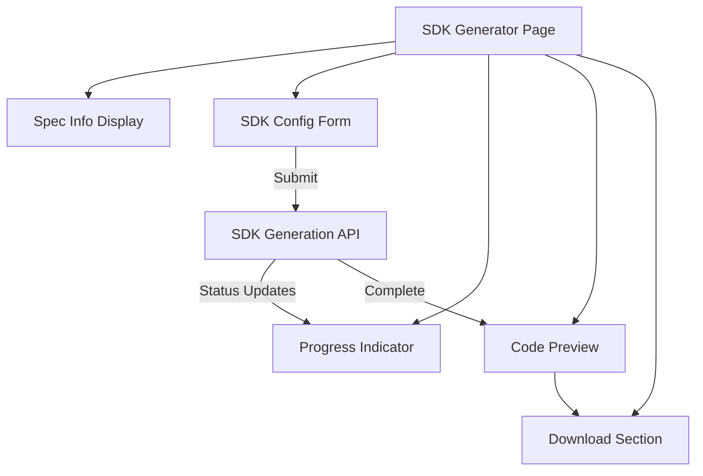
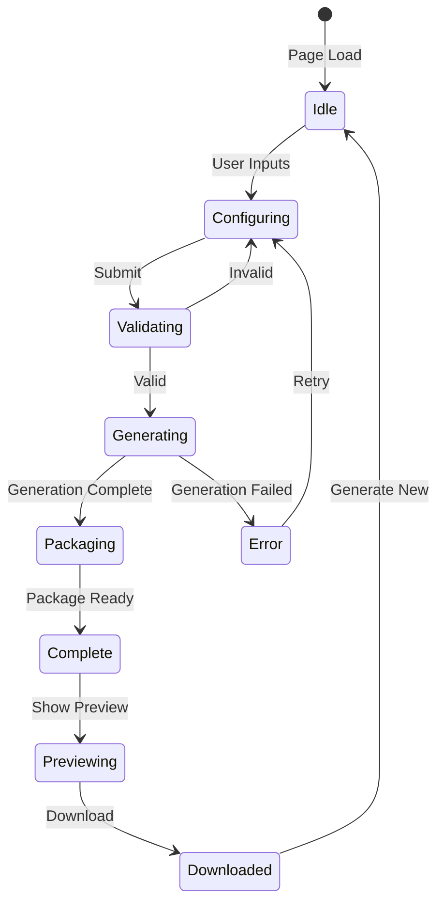

# SDK Generator UI Design

## Overview

The SDK generator UI provides an intuitive interface for configuring, generating, and downloading client SDKs from OpenAPI specifications. The design emphasizes real-time feedback, clear progress indication, and code preview capabilities. The UI is built with Next.js and NextUI components, featuring form validation, progress tracking, syntax-highlighted code previews, and seamless download functionality.

## Architecture

### Component Diagram



### State Flow



## Components and Interfaces

### 1. SDK Generator Page (`apps/web/app/sdk-generator/page.tsx`)

Main page component orchestrating the SDK generation workflow.

```typescript
interface SDKGeneratorPageProps {
  searchParams: {
    specId?: string;
  };
}

export default function SDKGeneratorPage({
  searchParams,
}: SDKGeneratorPageProps) {
  // State: spec, config, generationState, preview, error
  // Handlers: handleGenerate, handleDownload, handleRetry
  // Layout: Spec info → Config form → Progress → Preview → Download
}
```

**Layout Structure**:

```
┌─────────────────────────────────────────┐
│ Spec Info Card                          │
│ - Title, Version, Endpoint Count        │
└─────────────────────────────────────────┘
┌─────────────────────────────────────────┐
│ SDK Configuration Form                  │
│ - Language Selector                     │
│ - Package Name                          │
│ - Package Version                       │
│ - Author (optional)                     │
│ - Description (optional)                │
│ [Generate SDK Button]                   │
└─────────────────────────────────────────┘
┌─────────────────────────────────────────┐
│ Progress Indicator (when generating)    │
│ ████████░░░░░░░░ 60%                   │
│ Current Stage: Generating...            │
└─────────────────────────────────────────┘
┌─────────────────────────────────────────┐
│ Code Preview (when complete)            │
│ - API Client Sample                     │
│ - Type Definitions Sample               │
│ - Usage Example                         │
└─────────────────────────────────────────┘
┌─────────────────────────────────────────┐
│ Download Section (when complete)        │
│ [Download SDK Button]                   │
│ Package: my-api-client v1.0.0 (245 KB)  │
└─────────────────────────────────────────┘
```

### 2. Spec Info Display (`apps/web/components/SpecInfoDisplay.tsx`)

Displays OpenAPI specification information.

```typescript
interface SpecInfoDisplayProps {
  spec: OpenAPISpec;
  onBackToExplorer?: () => void;
}

export function SpecInfoDisplay({
  spec,
  onBackToExplorer,
}: SpecInfoDisplayProps) {
  // Display: title, version, endpoint count, base URL, auth requirements
  // Action: Link back to explorer
}
```

**UI Elements**:

- Card with spec icon
- Title and version badge
- Endpoint count with icon
- Base URL (truncated if long)
- Authentication badge (if required)
- "Back to Explorer" link

### 3. SDK Config Form (`apps/web/components/SdkConfigForm.tsx`)

Form for collecting SDK configuration.

```typescript
interface SdkConfigFormProps {
  onSubmit: (config: SDKConfig) => void;
  loading?: boolean;
  initialConfig?: Partial<SDKConfig>;
}

interface SdkConfigFormState {
  language: "typescript";
  packageName: string;
  packageVersion: string;
  author: string;
  description: string;
  errors: Record<string, string>;
}

export function SdkConfigForm({
  onSubmit,
  loading,
  initialConfig,
}: SdkConfigFormProps) {
  // State: form values, validation errors
  // Handlers: handleChange, handleSubmit, validateField
  // Validation: Real-time validation on blur
}
```

**Form Fields**:

1. **Language Selector**

   ```typescript
   <Select label="Target Language" value={language} onChange={setLanguage}>
     <SelectItem value="typescript">TypeScript</SelectItem>
     <SelectItem value="python" disabled>
       Python (Coming soon)
     </SelectItem>
     <SelectItem value="go" disabled>
       Go (Coming soon)
     </SelectItem>
     <SelectItem value="java" disabled>
       Java (Coming soon)
     </SelectItem>
   </Select>
   ```

2. **Package Name**

   ```typescript
   <Input
     label="Package Name"
     placeholder="my-api-client"
     value={packageName}
     onChange={handlePackageNameChange}
     errorMessage={errors.packageName}
     isInvalid={!!errors.packageName}
     description="Lowercase, hyphens allowed, no spaces"
   />
   ```

3. **Package Version**

   ```typescript
   <Input
     label="Version"
     placeholder="1.0.0"
     value={packageVersion}
     onChange={handleVersionChange}
     errorMessage={errors.packageVersion}
     isInvalid={!!errors.packageVersion}
     description="Semantic versioning (e.g., 1.0.0)"
   />
   ```

4. **Author (Optional)**

   ```typescript
   <Input
     label="Author"
     placeholder="Your Name"
     value={author}
     onChange={setAuthor}
   />
   ```

5. **Description (Optional)**
   ```typescript
   <Textarea
     label="Description"
     placeholder="Client library for My API"
     value={description}
     onChange={setDescription}
     maxLength={500}
   />
   ```

**Validation Logic**:

```typescript
const validatePackageName = (name: string): string | null => {
  if (!name) return "Package name is required";
  if (name.length < 1 || name.length > 214)
    return "Package name must be 1-214 characters";
  if (!/^[a-z0-9-]+$/.test(name))
    return "Package name must be lowercase with hyphens only";
  if (name.startsWith("-") || name.endsWith("-"))
    return "Package name cannot start or end with hyphen";
  return null;
};

const validateVersion = (version: string): string | null => {
  if (!version) return "Version is required";
  if (!/^\d+\.\d+\.\d+(-[a-z0-9]+)?$/.test(version))
    return "Version must follow semantic versioning (e.g., 1.0.0)";
  return null;
};
```

### 4. Progress Indicator (`apps/web/components/SdkGenerationProgress.tsx`)

Displays real-time generation progress.

```typescript
interface SdkGenerationProgressProps {
  generationId: string;
  onComplete: (result: GenerationResult) => void;
  onError: (error: string) => void;
}

interface ProgressState {
  stage: "validating" | "generating" | "packaging" | "complete";
  progress: number;
  message: string;
  estimatedTimeRemaining?: number;
}

export function SdkGenerationProgress({
  generationId,
  onComplete,
  onError,
}: SdkGenerationProgressProps) {
  // Poll /api/sdk/status every 2 seconds
  // Update progress bar and stage
  // Calculate estimated time remaining
  // Call onComplete when done
}
```

**UI Elements**:

- Progress bar (0-100%)
- Current stage label
- Stage icons (checkmark for complete, spinner for current)
- Estimated time remaining (if > 10 seconds)
- Cancel button (optional)

**Stage Mapping**:

```typescript
const STAGE_LABELS = {
  validating: "Validating specification...",
  generating: "Generating SDK code...",
  packaging: "Packaging files...",
  complete: "SDK ready for download!",
};

const STAGE_PROGRESS = {
  validating: 10,
  generating: 60,
  packaging: 90,
  complete: 100,
};
```

### 5. Code Preview (`apps/web/components/SdkCodePreview.tsx`)

Displays samples of generated SDK code.

```typescript
interface SdkCodePreviewProps {
  generationId: string;
  language: string;
}

interface CodeSample {
  title: string;
  code: string;
  language: string;
}

export function SdkCodePreview({
  generationId,
  language,
}: SdkCodePreviewProps) {
  // Fetch code samples from generation result
  // Display with syntax highlighting
  // Provide copy buttons
}
```

**Code Samples**:

1. **API Client Class**

   ```typescript
   // Sample from generated code
   import { Configuration, DefaultApi } from "my-api-client";

   const config = new Configuration({
     basePath: "https://api.example.com",
     apiKey: "your-api-key",
   });

   const api = new DefaultApi(config);
   ```

2. **Type Definitions**

   ```typescript
   // Sample interfaces
   export interface Pet {
     id: number;
     name: string;
     status: "available" | "pending" | "sold";
   }

   export interface ApiResponse {
     code: number;
     message: string;
   }
   ```

3. **Usage Example**
   ```typescript
   // Example usage
   async function getPet(petId: number) {
     try {
       const pet = await api.getPetById({ petId });
       console.log("Pet:", pet);
     } catch (error) {
       console.error("Error:", error);
     }
   }
   ```

**Syntax Highlighting**:

- Use `react-syntax-highlighter` with Prism
- Theme: VS Code Dark+ or similar
- Line numbers enabled
- Copy button in top-right corner

### 6. Download Section (`apps/web/components/SdkDownloadSection.tsx`)

Provides download functionality and metadata.

```typescript
interface SdkDownloadSectionProps {
  downloadUrl: string;
  packageName: string;
  packageVersion: string;
  fileSize: number;
  onGenerateNew?: () => void;
}

export function SdkDownloadSection({
  downloadUrl,
  packageName,
  packageVersion,
  fileSize,
  onGenerateNew,
}: SdkDownloadSectionProps) {
  // Display download button
  // Show package metadata
  // Provide "Generate New" option
}
```

**UI Elements**:

- Large primary "Download SDK" button
- Package name and version display
- File size display (formatted: KB/MB)
- Success icon and message
- "Generate New SDK" secondary button
- Download expiration notice (1 hour)

## Data Models

### Generation State

```typescript
interface GenerationState {
  status:
    | "idle"
    | "configuring"
    | "validating"
    | "generating"
    | "complete"
    | "error";
  generationId?: string;
  progress?: ProgressState;
  result?: GenerationResult;
  error?: string;
}

interface GenerationResult {
  downloadUrl: string;
  packageName: string;
  packageVersion: string;
  fileSize: number;
  codeSamples: CodeSample[];
}
```

### Form State

```typescript
interface FormState {
  values: SDKConfig;
  errors: Record<string, string>;
  touched: Record<string, boolean>;
  isValid: boolean;
  isSubmitting: boolean;
}
```

## Error Handling

### Error Display

```typescript
interface ErrorDisplayProps {
  error: string;
  onRetry?: () => void;
  onDismiss?: () => void;
}

export function ErrorDisplay({ error, onRetry, onDismiss }: ErrorDisplayProps) {
  // Display error message in alert/modal
  // Show retry button if applicable
  // Show dismiss button
}
```

**Error Types**:

1. **Validation Errors**

   - Display inline with form fields
   - Highlight invalid fields in red
   - Show specific error message below field

2. **Generation Errors**

   - Display in modal or alert
   - Show error message from API
   - Provide retry button
   - Log details to console

3. **Network Errors**
   - Display connection error message
   - Provide retry button
   - Show offline indicator if applicable

## Testing Strategy

### Component Tests

1. **SdkConfigForm Tests**

   - Test form rendering
   - Test validation logic
   - Test form submission
   - Test error display

2. **SdkGenerationProgress Tests**

   - Test progress updates
   - Test stage transitions
   - Test completion handling
   - Test error handling

3. **SdkCodePreview Tests**

   - Test code sample rendering
   - Test syntax highlighting
   - Test copy to clipboard
   - Test language switching

4. **SdkDownloadSection Tests**
   - Test download button
   - Test metadata display
   - Test generate new functionality

### Integration Tests

1. **End-to-End Generation Flow**

   - Fill form → Submit → Monitor progress → View preview → Download

2. **Error Recovery**

   - Submit invalid config → See errors → Fix → Retry → Success

3. **Multiple Generations**
   - Generate SDK → Download → Generate new → Verify state reset

### Manual Testing Checklist

- [ ] Fill form with valid data, verify generation works
- [ ] Fill form with invalid data, verify validation errors
- [ ] Monitor progress during generation
- [ ] View code preview after generation
- [ ] Copy code samples to clipboard
- [ ] Download SDK and verify ZIP contents
- [ ] Generate new SDK after download
- [ ] Test with slow network (throttling)
- [ ] Test error scenarios (invalid spec, timeout)

## Performance Considerations

1. **Progress Polling**

   - Poll every 2 seconds (not too frequent)
   - Stop polling when complete or error
   - Use exponential backoff if errors

2. **Code Preview**

   - Lazy load syntax highlighter
   - Limit code sample size (max 50 lines each)
   - Cache highlighted code

3. **Form Validation**
   - Debounce validation (300ms)
   - Validate on blur, not on every keystroke
   - Cache validation results

## Accessibility Considerations

1. **Form Accessibility**

   - Proper label associations
   - ARIA attributes for errors
   - Keyboard navigation support
   - Focus management

2. **Progress Indicator**

   - ARIA live region for updates
   - Screen reader announcements
   - Keyboard accessible cancel button

3. **Code Preview**
   - Keyboard accessible copy buttons
   - Screen reader friendly code blocks
   - High contrast syntax highlighting

## Future Enhancements

1. **Advanced Configuration**

   - Custom base URL override
   - Custom authentication configuration
   - Custom error handling options

2. **SDK Comparison**

   - Compare generated SDKs for different languages
   - Show differences in approach

3. **SDK Testing**

   - Test generated SDK in browser sandbox
   - Show example API calls working

4. **SDK Publishing**
   - Publish directly to NPM
   - Generate GitHub repository
   - Create documentation site
