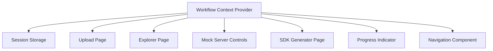
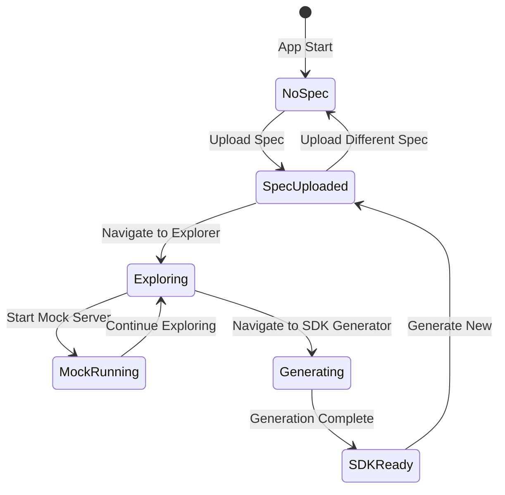

# Workflow Integration Design

## Overview

The workflow integration feature provides a unified state management system and navigation flow that connects all application components. Using React Context and session storage, the system maintains consistent state across pages, provides visual progress tracking, and enables seamless navigation through the spec upload → explore → mock → generate SDK workflow. The design emphasizes user experience, state persistence, and error recovery.

## Architecture

### Component Diagram



### State Flow



## Components and Interfaces

### 1. Workflow Context (`apps/web/contexts/workflow-context.tsx`)

Central state management for the entire application.

```typescript
interface WorkflowState {
  // Current spec
  currentSpec: OpenAPISpec | null;
  specId: string | null;
  specMetadata: {
    name: string;
    version: string;
    uploadedAt: Date;
  } | null;

  // Explorer state
  selectedEndpoint: EndpointInfo | null;
  requestConfig: RequestConfig | null;

  // Mock server state
  mockServer: {
    isRunning: boolean;
    url: string | null;
    port: number | null;
  };

  // SDK generation state
  sdkConfig: SDKConfig | null;
  generatedSdk: {
    downloadUrl: string | null;
    packageName: string | null;
  } | null;

  // Workflow progress
  completedSteps: WorkflowStep[];
  currentStep: WorkflowStep;

  // Recent specs
  recentSpecs: SpecMetadata[];
}

type WorkflowStep = "upload" | "explore" | "mock" | "generate";

interface WorkflowContextValue {
  state: WorkflowState;

  // Spec actions
  setCurrentSpec: (spec: OpenAPISpec, metadata: SpecMetadata) => void;
  clearCurrentSpec: () => void;

  // Explorer actions
  setSelectedEndpoint: (endpoint: EndpointInfo) => void;
  setRequestConfig: (config: RequestConfig) => void;

  // Mock server actions
  setMockServerStatus: (status: {
    isRunning: boolean;
    url?: string;
    port?: number;
  }) => void;

  // SDK actions
  setSdkConfig: (config: SDKConfig) => void;
  setGeneratedSdk: (sdk: { downloadUrl: string; packageName: string }) => void;

  // Workflow actions
  completeStep: (step: WorkflowStep) => void;
  setCurrentStep: (step: WorkflowStep) => void;
  resetWorkflow: () => void;

  // Recent specs actions
  addRecentSpec: (metadata: SpecMetadata) => void;
  loadRecentSpec: (specId: string) => Promise<void>;
}

export const WorkflowProvider: React.FC<{ children: React.ReactNode }>;
export const useWorkflow: () => WorkflowContextValue;
```

**State Persistence**:

```typescript
// Save to session storage on every state change
useEffect(() => {
  sessionStorage.setItem("workflow-state", JSON.stringify(state));
}, [state]);

// Load from session storage on mount
useEffect(() => {
  const saved = sessionStorage.getItem("workflow-state");
  if (saved) {
    setState(JSON.parse(saved));
  }
}, []);
```

### 2. Progress Indicator (`apps/web/components/WorkflowProgress.tsx`)

Visual representation of workflow progress.

```typescript
interface WorkflowProgressProps {
  currentStep: WorkflowStep;
  completedSteps: WorkflowStep[];
  onStepClick?: (step: WorkflowStep) => void;
}

export function WorkflowProgress({
  currentStep,
  completedSteps,
  onStepClick,
}: WorkflowProgressProps) {
  // Render step indicators
  // Show checkmarks for completed
  // Highlight current step
  // Allow navigation to completed steps
}
```

**UI Design**:

```
┌─────────────────────────────────────────────────────────┐
│  ✓ Upload  →  ● Explore  →  ○ Mock  →  ○ Generate SDK  │
└─────────────────────────────────────────────────────────┘

Legend:
✓ = Completed (green, clickable)
● = Current (blue, bold)
○ = Not started (gray, disabled)
→ = Connector line
```

**Step Definitions**:

```typescript
const WORKFLOW_STEPS: Record<WorkflowStep, StepInfo> = {
  upload: {
    label: "Upload Spec",
    icon: "upload",
    path: "/upload",
  },
  explore: {
    label: "Explore API",
    icon: "search",
    path: "/explorer",
  },
  mock: {
    label: "Mock Server",
    icon: "server",
    path: "/explorer", // Mock is part of explorer
  },
  generate: {
    label: "Generate SDK",
    icon: "code",
    path: "/sdk-generator",
  },
};
```

### 3. Navigation Component (`apps/web/components/WorkflowNavigation.tsx`)

Provides contextual navigation buttons.

```typescript
interface WorkflowNavigationProps {
  currentStep: WorkflowStep;
  onNext?: () => void;
  onBack?: () => void;
}

export function WorkflowNavigation({
  currentStep,
  onNext,
  onBack,
}: WorkflowNavigationProps) {
  // Show "Next Step" button based on current step
  // Show "Back" button if not on first step
  // Disable buttons if prerequisites not met
}
```

**Navigation Logic**:

```typescript
const getNextStep = (current: WorkflowStep): WorkflowStep | null => {
  const order: WorkflowStep[] = ["upload", "explore", "mock", "generate"];
  const index = order.indexOf(current);
  return index < order.length - 1 ? order[index + 1] : null;
};

const canNavigateToStep = (
  step: WorkflowStep,
  state: WorkflowState
): boolean => {
  switch (step) {
    case "upload":
      return true;
    case "explore":
      return state.currentSpec !== null;
    case "mock":
      return state.currentSpec !== null;
    case "generate":
      return state.currentSpec !== null;
    default:
      return false;
  }
};
```

### 4. Spec Selector (`apps/web/components/SpecSelector.tsx`)

Dropdown for switching between specs.

```typescript
interface SpecSelectorProps {
  currentSpec: SpecMetadata | null;
  recentSpecs: SpecMetadata[];
  onSpecSelect: (specId: string) => void;
  onUploadNew: () => void;
}

export function SpecSelector({
  currentSpec,
  recentSpecs,
  onSpecSelect,
  onUploadNew,
}: SpecSelectorProps) {
  // Display current spec name
  // Show dropdown with recent specs
  // Provide "Upload New" option
}
```

**UI Design**:

```
┌─────────────────────────────┐
│ Petstore API v1.0.0      ▼ │
└─────────────────────────────┘
  ↓ (on click)
┌─────────────────────────────┐
│ ✓ Petstore API v1.0.0       │
│   Stripe API v2023-10-16    │
│   GitHub API v3             │
│ ─────────────────────────── │
│ + Upload New Spec           │
└─────────────────────────────┘
```

### 5. Mock Server Status Widget (`apps/web/components/MockServerStatus.tsx`)

Global mock server status display.

```typescript
interface MockServerStatusProps {
  isRunning: boolean;
  url: string | null;
  port: number | null;
}

export function MockServerStatus({
  isRunning,
  url,
  port,
}: MockServerStatusProps) {
  // Show status badge
  // Show URL if running
  // Provide quick actions (start/stop)
}
```

**UI Design**:

```
┌──────────────────────────────┐
│ 🟢 Mock Server Running       │
│ http://localhost:4010        │
│ [Stop] [Copy URL]            │
└──────────────────────────────┘

or

┌──────────────────────────────┐
│ ⚫ Mock Server Stopped        │
│ [Start Mock Server]          │
└──────────────────────────────┘
```

### 6. Quick Demo Mode (`apps/web/components/QuickDemo.tsx`)

Automated demo walkthrough.

```typescript
interface DemoStep {
  title: string;
  description: string;
  action: () => Promise<void>;
  duration: number;
}

export function QuickDemo() {
  const [isRunning, setIsRunning] = useState(false);
  const [currentStep, setCurrentStep] = useState(0);

  const demoSteps: DemoStep[] = [
    {
      title: "Loading Petstore API",
      description: "Uploading sample OpenAPI specification...",
      action: async () => {
        // Load Petstore spec
        // Navigate to explorer
      },
      duration: 2000,
    },
    {
      title: "Exploring Endpoints",
      description: "Viewing available API endpoints...",
      action: async () => {
        // Select an endpoint
        // Show details
      },
      duration: 3000,
    },
    {
      title: "Starting Mock Server",
      description: "Launching mock API server...",
      action: async () => {
        // Start mock server
        // Toggle mock mode
      },
      duration: 3000,
    },
    {
      title: "Executing Request",
      description: "Making a test API call...",
      action: async () => {
        // Execute request
        // Show response
      },
      duration: 4000,
    },
    {
      title: "Generating SDK",
      description: "Creating TypeScript client library...",
      action: async () => {
        // Navigate to SDK generator
        // Fill config
        // Generate SDK
      },
      duration: 5000,
    },
  ];

  // Execute steps sequentially
  // Show progress
  // Allow exit at any time
}
```

### 7. Enhanced App Layout (`apps/web/app/layout.tsx`)

Update root layout to include workflow components.

```typescript
export default function RootLayout({
  children,
}: {
  children: React.ReactNode;
}) {
  return (
    <html>
      <body>
        <WorkflowProvider>
          <AppHeader>
            <SpecSelector />
            <MockServerStatus />
          </AppHeader>

          <WorkflowProgress />

          <main>{children}</main>

          <WorkflowNavigation />
        </WorkflowProvider>
      </body>
    </html>
  );
}
```

## Data Models

### Workflow State Schema

```typescript
interface WorkflowStateSchema {
  version: number; // For migration
  currentSpec: {
    id: string;
    data: OpenAPISpec;
    metadata: SpecMetadata;
  } | null;
  explorer: {
    selectedEndpointId: string | null;
    requestConfig: RequestConfig | null;
  };
  mockServer: {
    isRunning: boolean;
    url: string | null;
    port: number | null;
  };
  sdkGenerator: {
    config: SDKConfig | null;
    result: GenerationResult | null;
  };
  progress: {
    completedSteps: WorkflowStep[];
    currentStep: WorkflowStep;
  };
  recentSpecs: SpecMetadata[];
}
```

### Recent Specs Storage

```typescript
// Stored in localStorage (persists across sessions)
interface RecentSpecsStorage {
  specs: Array<{
    id: string;
    name: string;
    version: string;
    uploadedAt: string;
    lastAccessedAt: string;
  }>;
}

// Keep only 5 most recent
// Sort by lastAccessedAt
```

## Error Handling

### Navigation Guards

```typescript
const useNavigationGuard = (requiredStep: WorkflowStep) => {
  const { state } = useWorkflow();
  const router = useRouter();

  useEffect(() => {
    if (!canNavigateToStep(requiredStep, state)) {
      // Redirect to appropriate starting point
      if (!state.currentSpec) {
        router.push("/upload");
      } else {
        router.push("/explorer");
      }
    }
  }, [requiredStep, state, router]);
};
```

### Error Recovery

```typescript
interface ErrorRecoveryOptions {
  retry?: () => void;
  goBack?: () => void;
  reset?: () => void;
}

export function ErrorRecovery({
  error,
  options,
}: {
  error: Error;
  options: ErrorRecoveryOptions;
}) {
  return (
    <div>
      <h3>Something went wrong</h3>
      <p>{error.message}</p>
      {options.retry && <Button onClick={options.retry}>Retry</Button>}
      {options.goBack && <Button onClick={options.goBack}>Go Back</Button>}
      {options.reset && <Button onClick={options.reset}>Start Over</Button>}
    </div>
  );
}
```

## Testing Strategy

### Context Tests

1. **WorkflowContext Tests**

   - Test state initialization
   - Test state updates
   - Test session storage persistence
   - Test state reset

2. **Navigation Guard Tests**
   - Test redirect logic
   - Test prerequisite checking
   - Test allowed navigation

### Component Tests

1. **WorkflowProgress Tests**

   - Test step rendering
   - Test completion indicators
   - Test navigation clicks

2. **SpecSelector Tests**

   - Test spec switching
   - Test recent specs display
   - Test upload new action

3. **QuickDemo Tests**
   - Test step execution
   - Test progress display
   - Test exit functionality

### Integration Tests

1. **Complete Workflow**

   - Upload spec → Explore → Start mock → Generate SDK
   - Verify state persistence at each step
   - Verify navigation works correctly

2. **Spec Switching**

   - Upload spec A → Explore → Upload spec B → Verify state reset

3. **Error Recovery**
   - Trigger error → Verify recovery options → Retry → Verify success

## Performance Considerations

1. **State Updates**

   - Debounce session storage writes (500ms)
   - Use shallow comparison for state changes
   - Memoize expensive computations

2. **Recent Specs**

   - Limit to 5 specs
   - Lazy load spec data
   - Cache in memory

3. **Progress Indicator**
   - Render only when visible
   - Use CSS transitions for smooth updates

## Accessibility Considerations

1. **Progress Indicator**

   - ARIA labels for each step
   - Keyboard navigation support
   - Screen reader announcements

2. **Navigation**

   - Focus management on page transitions
   - Skip links for main content
   - Clear button labels

3. **Error Messages**
   - ARIA live regions for errors
   - Clear, actionable error text
   - Keyboard accessible recovery options

## Future Enhancements

1. **Collaboration**

   - Share workflow state via URL
   - Export/import workflow state
   - Team workspaces

2. **History**

   - Undo/redo functionality
   - Workflow history timeline
   - Restore previous sessions

3. **Customization**
   - Custom workflow steps
   - Configurable navigation
   - Personalized layouts
